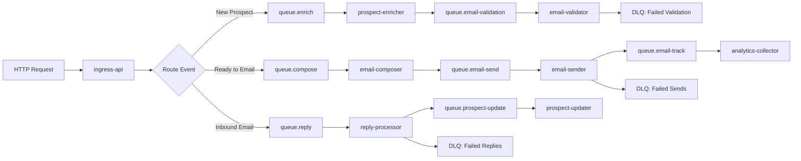
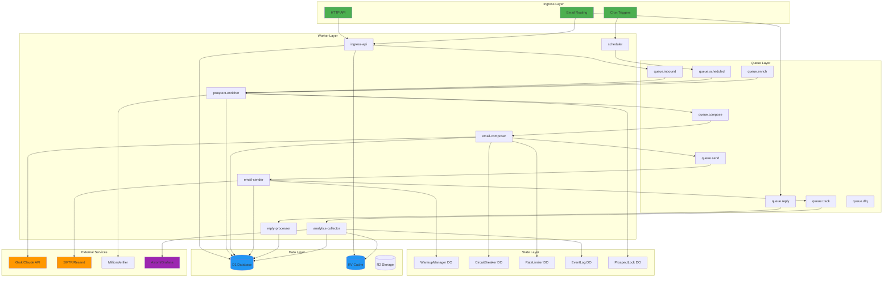

# Jengu CRM v2 - World-Class Distributed Architecture

**Version:** 2.0
**Date:** 2025-12-11
**Status:** Design Document

---

## Executive Summary

This document outlines a complete architectural redesign of Jengu CRM from a synchronous, cron-based system to an **event-driven, globally distributed, fault-tolerant system** optimized for Cloudflare's serverless platform.

### Goals

- ✅ **Global Reliability**: Zero single points of failure
- ✅ **Extreme Throughput**: Handle 10,000+ emails/day across regions
- ✅ **Event-Driven**: Fully asynchronous, queue-based processing
- ✅ **Self-Healing**: Automatic failover, retries, and circuit breakers
- ✅ **Observable**: Distributed tracing, metrics, and real-time monitoring
- ✅ **Cost-Efficient**: Stay within Cloudflare free tier where possible

---

## Part 1: Current System Weaknesses

### Critical Issues

| # | Weakness | Impact | Severity |
|---|----------|--------|----------|
| 1 | **Monolithic Worker** | Single worker handles HTTP, cron, enrichment - no separation of concerns | 🔴 Critical |
| 2 | **Synchronous Processing** | All operations block, no parallelization | 🔴 Critical |
| 3 | **No Queue System** | Direct function calls, tight coupling, no retry logic | 🔴 Critical |
| 4 | **Single-Region D1** | Database bottleneck, no geo-distribution | 🟡 High |
| 5 | **Crude Rate Limiting** | 30% random skip for "human-like" sending is unpredictable | 🟡 High |
| 6 | **In-Band Enrichment** | Enrichment runs in cron, blocks other operations | 🟡 High |
| 7 | **Basic AI Failover** | Simple try/catch, no sophisticated retry strategies | 🟡 High |
| 8 | **No Distributed Tracing** | Can't track requests across workers/DOs | 🟢 Medium |
| 9 | **Manual Scaling** | No auto-scaling based on load | 🟢 Medium |
| 10 | **Limited Observability** | Console logs only, no structured metrics | 🟢 Medium |

### Architectural Debt

```
Current: Cron → Worker → DB
         ↓
    Everything happens
    synchronously in
    5-minute batches
```

**Problems:**
- If cron fails, nothing happens
- If worker crashes mid-batch, lose progress
- Can't scale horizontally
- Hard to debug failures
- No replay capability
- Tight coupling everywhere

---

## Part 2: New Event-Driven Architecture

### High-Level Overview

```
┌─────────────────────────────────────────────────────────────────┐
│                    CLOUDFLARE GLOBAL EDGE                        │
├─────────────────────────────────────────────────────────────────┤
│                                                                  │
│  ┌──────────────┐     ┌──────────────┐     ┌──────────────┐   │
│  │   INGRESS    │────►│    QUEUES    │────►│   WORKERS    │   │
│  │   Workers    │     │  (Event Bus) │     │ (Consumers)  │   │
│  └──────────────┘     └──────────────┘     └──────────────┘   │
│         │                     │                     │           │
│         │                     │                     │           │
│         ▼                     ▼                     ▼           │
│  ┌──────────────┐     ┌──────────────┐     ┌──────────────┐   │
│  │  API Gateway │     │  Event Store │     │ Durable      │   │
│  │  (HTTP)      │     │  (Analytics) │     │ Objects      │   │
│  └──────────────┘     └──────────────┘     └──────────────┘   │
│                                                     │           │
│                                              ┌──────┴──────┐   │
│                                              │             │   │
│                                         ┌────▼────┐  ┌────▼────┐
│                                         │   D1    │  │   KV    │
│                                         │ (Data)  │  │ (Cache) │
│                                         └─────────┘  └─────────┘
│                                                                  │
└─────────────────────────────────────────────────────────────────┘
```

### Core Principles

1. **Event-First**: Every action emits an event
2. **Queue-Based**: All processing through Cloudflare Queues
3. **Idempotent**: Safe to retry any operation
4. **Stateless Workers**: All state in DOs/D1/KV
5. **Observable**: Every event traceable end-to-end
6. **Self-Healing**: Automatic retries, circuit breakers, dead-letter queues

---

## Part 3: Microservices Architecture

### Worker Services (Specialized)

| Worker | Purpose | Triggered By | Outputs To |
|--------|---------|--------------|------------|
| **ingress-api** | HTTP API, webhooks | User/External | `events.inbound` queue |
| **scheduler** | Cron orchestration | Cloudflare Cron | `events.scheduled` queue |
| **prospect-enricher** | Find websites/emails | `queue.enrich` | `queue.email-validation` |
| **email-composer** | Generate AI emails | `queue.compose` | `queue.email-send` |
| **email-sender** | SMTP/Resend sending | `queue.email-send` | `queue.email-track` |
| **reply-processor** | Process inbound emails | Email Routing | `queue.prospect-update` |
| **analytics-collector** | Aggregate metrics | All queues | D1 + KV |
| **circuit-breaker** | Health monitoring | Heartbeat events | Admin alerts |

### Queue Structure



### Event Flow Example: Send Email

```
1. [Scheduler Worker]
   CRON triggers → Emit SendEmailBatch event

2. [Queue: events.scheduled]
   Event: { type: "SendEmailBatch", maxEmails: 3 }

3. [Prospect Selector Worker]
   Read D1 → Find eligible prospects → Emit ComposeEmail per prospect

4. [Queue: queue.compose]
   Event: { type: "ComposeEmail", prospectId: "abc", strategy: "cold_direct" }

5. [Email Composer Worker]
   Call AI API → Generate email → Emit SendEmail

6. [Queue: queue.email-send]
   Event: { type: "SendEmail", prospectId: "abc", to: "...", subject: "...", body: "..." }

7. [Email Sender Worker]
   Check warmup → Get inbox → Send SMTP → Emit EmailSent

8. [Queue: queue.email-track]
   Event: { type: "EmailSent", messageId: "xyz", ... }

9. [Analytics Collector Worker]
   Write to D1 → Update metrics → Done
```

**Benefits:**
- Each step can retry independently
- Can replay from any point
- Easy to add new steps (e.g., spam check)
- Full audit trail
- Can process steps in parallel

---

## Part 4: Durable Objects Redesign

### DO Architecture

| Durable Object | Purpose | Scope | State |
|----------------|---------|-------|-------|
| **WarmupManager** | Email limits per inbox | Per inbox | Daily counts, reputation |
| **CircuitBreaker** | Health & failover | Per service | Circuit state, failures |
| **RateLimiter** | AI API quotas | Per API key | Token bucket state |
| **DeduplicationStore** | Event deduplication | Global | Bloom filter + timestamps |
| **ProspectLock** | Prevent double-processing | Per prospect | Lock state, owner |
| **EventLog** | Distributed tracing | Per trace ID | Event chain |

### Example: Distributed Lock for Prospect Processing

```typescript
// ProspectLock Durable Object
class ProspectLock {
  async fetch(request: Request) {
    const { prospectId, workerId, ttl } = await request.json();

    // Try to acquire lock
    const existing = await this.state.storage.get(`lock:${prospectId}`);

    if (existing && Date.now() < existing.expiresAt) {
      return Response.json({ locked: true, owner: existing.owner });
    }

    // Acquire lock
    await this.state.storage.put(`lock:${prospectId}`, {
      owner: workerId,
      expiresAt: Date.now() + ttl
    });

    return Response.json({ locked: false, acquired: true });
  }
}
```

**Usage:** Before enriching or emailing a prospect, acquire lock to prevent duplicate work.

---

## Part 5: Cloudflare Queues Design

### Queue Configuration

```toml
# wrangler.toml
[[queues.producers]]
queue = "events-inbound"
binding = "QUEUE_INBOUND"

[[queues.producers]]
queue = "events-scheduled"
binding = "QUEUE_SCHEDULED"

[[queues.producers]]
queue = "queue-enrich"
binding = "QUEUE_ENRICH"

[[queues.producers]]
queue = "queue-compose"
binding = "QUEUE_COMPOSE"

[[queues.producers]]
queue = "queue-email-send"
binding = "QUEUE_EMAIL_SEND"

[[queues.producers]]
queue = "queue-email-track"
binding = "QUEUE_EMAIL_TRACK"

[[queues.producers]]
queue = "queue-reply"
binding = "QUEUE_REPLY"

[[queues.producers]]
queue = "queue-dlq"
binding = "QUEUE_DLQ"

[[queues.consumers]]
queue = "queue-enrich"
max_batch_size = 10
max_retries = 3
dead_letter_queue = "queue-dlq"
```

### Queue Message Schema

```typescript
// Base event
interface Event {
  id: string;              // UUID
  type: string;            // Event type
  timestamp: number;       // Unix timestamp
  traceId: string;         // Distributed trace ID
  parentId?: string;       // Parent event ID
  source: string;          // Worker that emitted
  retryCount: number;      // Retry attempts
  metadata: Record<string, any>;
}

// Example: ComposeEmail event
interface ComposeEmailEvent extends Event {
  type: "ComposeEmail";
  metadata: {
    prospectId: string;
    campaignId: string;
    strategy: string;
    isFollowUp: boolean;
  };
}
```

### Retry Strategy

```typescript
// Exponential backoff with jitter
function calculateRetryDelay(attemptNumber: number): number {
  const baseDelay = 1000; // 1 second
  const maxDelay = 60000; // 1 minute
  const exponentialDelay = Math.min(
    baseDelay * Math.pow(2, attemptNumber),
    maxDelay
  );
  const jitter = Math.random() * 1000; // 0-1s jitter
  return exponentialDelay + jitter;
}

// Retry policy per queue
const RETRY_POLICIES = {
  'queue-enrich': { maxRetries: 5, backoff: 'exponential' },
  'queue-compose': { maxRetries: 3, backoff: 'exponential' },
  'queue-email-send': { maxRetries: 2, backoff: 'linear' },
  'queue-reply': { maxRetries: 1, backoff: 'none' },
};
```

---

## Part 6: AI Component Fault Tolerance

### Multi-Layer Fallback Strategy

```
Primary: Grok-3-mini (x.ai)
   ↓ (if rate limit or error)
Fallback 1: Grok-3-mini (different key, rate limiter)
   ↓ (if still fails)
Fallback 2: Claude-3-haiku (Anthropic)
   ↓ (if still fails)
Fallback 3: Template-based (no AI)
```

### Circuit Breaker per AI Provider

```typescript
// Circuit Breaker Durable Object
class AICircuitBreaker {
  private state: Map<string, CircuitState> = new Map();

  async checkAndCall(provider: string, fn: () => Promise<any>) {
    const circuit = this.state.get(provider);

    // If circuit open, reject immediately
    if (circuit?.state === 'open') {
      if (Date.now() < circuit.openUntil) {
        throw new Error(`Circuit open for ${provider}`);
      }
      // Try half-open
      circuit.state = 'half-open';
    }

    try {
      const result = await fn();
      this.recordSuccess(provider);
      return result;
    } catch (error) {
      this.recordFailure(provider);
      throw error;
    }
  }

  private recordFailure(provider: string) {
    const circuit = this.state.get(provider) || { failures: 0, state: 'closed' };
    circuit.failures++;

    if (circuit.failures >= 3) {
      circuit.state = 'open';
      circuit.openUntil = Date.now() + 60000; // 1 minute
    }

    this.state.set(provider, circuit);
  }
}
```

### Rate Limiter with Token Bucket

```typescript
// Rate Limiter Durable Object
class AIRateLimiter {
  private buckets: Map<string, TokenBucket> = new Map();

  async acquire(apiKey: string, tokens: number = 1): Promise<boolean> {
    const bucket = this.getBucket(apiKey);

    // Refill tokens based on time elapsed
    const now = Date.now();
    const elapsed = now - bucket.lastRefill;
    const tokensToAdd = (elapsed / 1000) * bucket.refillRate;
    bucket.tokens = Math.min(bucket.capacity, bucket.tokens + tokensToAdd);
    bucket.lastRefill = now;

    // Try to consume tokens
    if (bucket.tokens >= tokens) {
      bucket.tokens -= tokens;
      return true;
    }

    return false;
  }

  private getBucket(apiKey: string): TokenBucket {
    if (!this.buckets.has(apiKey)) {
      this.buckets.set(apiKey, {
        capacity: 100,      // Max tokens
        tokens: 100,        // Current tokens
        refillRate: 10,     // Tokens per second
        lastRefill: Date.now()
      });
    }
    return this.buckets.get(apiKey)!;
  }
}
```

### AI Gateway Pattern

```typescript
class AIGateway {
  async generateEmail(
    prospect: Prospect,
    strategy: string,
    env: Env
  ): Promise<{ subject: string; body: string }> {
    const traceId = crypto.randomUUID();

    // Try primary provider
    try {
      return await this.tryProvider('grok', prospect, strategy, env, traceId);
    } catch (error) {
      console.warn(`Grok failed: ${error}, trying fallback`);
    }

    // Try fallback provider
    try {
      return await this.tryProvider('claude', prospect, strategy, env, traceId);
    } catch (error) {
      console.error(`Claude failed: ${error}, using template`);
    }

    // Last resort: template
    return this.generateFromTemplate(prospect, strategy);
  }

  private async tryProvider(
    provider: string,
    prospect: Prospect,
    strategy: string,
    env: Env,
    traceId: string
  ) {
    // Check circuit breaker
    const breaker = env.CIRCUIT_BREAKER.get(
      env.CIRCUIT_BREAKER.idFromName(provider)
    );
    const canCall = await breaker.fetch(new Request('http://do/can-call'));
    if (!canCall.ok) {
      throw new Error('Circuit open');
    }

    // Check rate limiter
    const limiter = env.RATE_LIMITER.get(
      env.RATE_LIMITER.idFromName(provider)
    );
    const allowed = await limiter.fetch(new Request('http://do/acquire'));
    if (!allowed.ok) {
      throw new Error('Rate limited');
    }

    // Make API call with timeout
    const controller = new AbortController();
    const timeout = setTimeout(() => controller.abort(), 15000); // 15s timeout

    try {
      const result = await this.callAI(provider, prospect, strategy, env, {
        signal: controller.signal,
        traceId
      });

      // Record success
      await breaker.fetch(new Request('http://do/record-success', { method: 'POST' }));

      return result;
    } catch (error) {
      // Record failure
      await breaker.fetch(new Request('http://do/record-failure', { method: 'POST' }));
      throw error;
    } finally {
      clearTimeout(timeout);
    }
  }
}
```

---

## Part 7: Distributed Tracing & Observability

### Trace Context

Every event carries a trace context:

```typescript
interface TraceContext {
  traceId: string;      // Global trace ID
  spanId: string;       // Current span ID
  parentSpanId?: string;
  startTime: number;
  attributes: Record<string, any>;
}
```

### Event Log Durable Object

```typescript
class EventLog {
  async fetch(request: Request) {
    const { traceId, event } = await request.json();

    // Append event to trace
    const trace = await this.state.storage.get<Trace>(traceId) || {
      id: traceId,
      events: [],
      startTime: Date.now()
    };

    trace.events.push({
      timestamp: Date.now(),
      worker: event.source,
      type: event.type,
      duration: event.duration,
      error: event.error
    });

    await this.state.storage.put(traceId, trace);

    return Response.json({ success: true });
  }

  // Get full trace
  async getTrace(traceId: string): Promise<Trace> {
    return await this.state.storage.get(traceId);
  }
}
```

### Logging to External Services

```typescript
// Send traces to external observability platform
async function emitTrace(trace: Trace, env: Env) {
  // Option 1: Axiom (Cloudflare integration)
  if (env.AXIOM_TOKEN) {
    await fetch('https://api.axiom.co/v1/datasets/jengu-traces/ingest', {
      method: 'POST',
      headers: {
        'Authorization': `Bearer ${env.AXIOM_TOKEN}`,
        'Content-Type': 'application/json'
      },
      body: JSON.stringify([trace])
    });
  }

  // Option 2: Grafana Cloud
  if (env.GRAFANA_URL) {
    await fetch(env.GRAFANA_URL, {
      method: 'POST',
      headers: {
        'Authorization': `Bearer ${env.GRAFANA_TOKEN}`,
        'Content-Type': 'application/json'
      },
      body: JSON.stringify({
        streams: [{
          stream: { service: 'jengu-crm' },
          values: [[Date.now() * 1000000, JSON.stringify(trace)]]
        }]
      })
    });
  }
}
```

### Metrics Collection

```typescript
// Analytics Collector Worker
async function handleEmailSentEvent(event: EmailSentEvent, env: Env) {
  // Write to D1 for querying
  await env.DB.prepare(`
    INSERT INTO emails (id, prospect_id, sent_at, ...)
    VALUES (?, ?, ?, ...)
  `).bind(...).run();

  // Update KV metrics (fast reads)
  const today = new Date().toISOString().split('T')[0];
  const key = `metrics:${today}:emails_sent`;
  await env.KV_METRICS.put(key,
    ((await env.KV_METRICS.get(key) as number) || 0) + 1
  );

  // Emit to analytics platform
  if (env.ANALYTICS_ENDPOINT) {
    await fetch(env.ANALYTICS_ENDPOINT, {
      method: 'POST',
      body: JSON.stringify({
        metric: 'email_sent',
        timestamp: Date.now(),
        tags: {
          inbox: event.inboxId,
          campaign: event.campaignId
        }
      })
    });
  }
}
```

---

## Part 8: Multi-Region Strategy

### Geo-Distribution

```
┌──────────────────────────────────────────────────────────────┐
│                    CLOUDFLARE GLOBAL EDGE                     │
├──────────────────────────────────────────────────────────────┤
│                                                               │
│  ┌─────────────┐      ┌─────────────┐      ┌─────────────┐ │
│  │   Region:   │      │   Region:   │      │   Region:   │ │
│  │   Americas  │      │   Europe    │      │    Asia     │ │
│  └──────┬──────┘      └──────┬──────┘      └──────┬──────┘ │
│         │                     │                     │         │
│         └─────────────────────┼─────────────────────┘         │
│                               │                               │
│                        ┌──────▼──────┐                        │
│                        │  D1 Primary │                        │
│                        │  (US-East)  │                        │
│                        └──────┬──────┘                        │
│                               │                               │
│                        ┌──────▼──────┐                        │
│                        │  D1 Replica │                        │
│                        │  (EU-West)  │                        │
│                        └─────────────┘                        │
│                                                               │
└──────────────────────────────────────────────────────────────┘
```

### Regional Routing

```typescript
// Determine optimal region for processing
function getOptimalRegion(prospect: Prospect): string {
  const timezone = prospect.timezone || inferTimezone(prospect.city, prospect.country);

  if (timezone.startsWith('America/')) return 'us-east';
  if (timezone.startsWith('Europe/')) return 'eu-west';
  if (timezone.startsWith('Asia/')) return 'asia-pacific';

  return 'us-east'; // Default
}

// Route to regional queue
async function enqueueEnrichment(prospect: Prospect, env: Env) {
  const region = getOptimalRegion(prospect);
  const queue = env[`QUEUE_ENRICH_${region.toUpperCase().replace('-', '_')}`];

  await queue.send({
    type: 'EnrichProspect',
    prospectId: prospect.id,
    region,
    timestamp: Date.now()
  });
}
```

### Read Replicas

```typescript
// Use read replicas for queries
async function getProspect(id: string, env: Env): Promise<Prospect> {
  // Try local replica first (faster)
  try {
    return await env.DB_REPLICA.prepare(`
      SELECT * FROM prospects WHERE id = ?
    `).bind(id).first();
  } catch (error) {
    // Fallback to primary
    return await env.DB.prepare(`
      SELECT * FROM prospects WHERE id = ?
    `).bind(id).first();
  }
}
```

---

## Part 9: Failure Modes & Mitigation

### Failure Scenarios

| Scenario | Impact | Detection | Mitigation | Recovery Time |
|----------|--------|-----------|------------|---------------|
| **Worker Crash** | Lost in-flight requests | No response | Queue retry | < 1 minute |
| **D1 Outage** | Can't read/write data | Query timeout | KV cache + queue buffer | < 5 minutes |
| **AI API Down** | Can't generate emails | API error | Fallback AI + templates | < 30 seconds |
| **Queue Backlog** | Delayed processing | Queue depth metric | Auto-scale consumers | < 2 minutes |
| **SMTP Failure** | Can't send emails | Send error | Inbox rotation + circuit breaker | < 1 minute |
| **DO Unavailable** | Lost state | Fetch timeout | Recreate from DB | < 30 seconds |
| **Network Partition** | Regional isolation | Heartbeat missing | Route to healthy region | < 2 minutes |

### Dead Letter Queue Handling

```typescript
// DLQ Consumer Worker
async function processDLQ(batch: Message[], env: Env) {
  for (const message of batch) {
    const event = message.body as Event;

    // Determine failure reason
    const reason = classifyFailure(event);

    switch (reason) {
      case 'transient':
        // Retry with longer delay
        await requeue(event, env, 60000); // 1 minute
        break;

      case 'invalid_data':
        // Store for manual review
        await env.DB.prepare(`
          INSERT INTO failed_events (id, type, data, reason, created_at)
          VALUES (?, ?, ?, ?, datetime('now'))
        `).bind(event.id, event.type, JSON.stringify(event), 'invalid_data').run();
        break;

      case 'permanent':
        // Alert and archive
        await sendAlert(env, {
          severity: 'error',
          message: `Permanent failure for event ${event.id}`,
          event
        });
        break;
    }
  }
}
```

### Health Checks

```typescript
// Health Check Endpoint
async function healthCheck(env: Env): Promise<HealthStatus> {
  const checks = await Promise.allSettled([
    checkDatabase(env),
    checkQueues(env),
    checkDurableObjects(env),
    checkExternalAPIs(env)
  ]);

  const status: HealthStatus = {
    overall: 'healthy',
    components: {
      database: checks[0].status === 'fulfilled' && checks[0].value,
      queues: checks[1].status === 'fulfilled' && checks[1].value,
      durableObjects: checks[2].status === 'fulfilled' && checks[2].value,
      externalAPIs: checks[3].status === 'fulfilled' && checks[3].value
    },
    timestamp: Date.now()
  };

  if (Object.values(status.components).some(v => !v)) {
    status.overall = 'degraded';
  }

  return status;
}
```

---

## Part 10: Implementation Roadmap

### Phase 1: Foundation (Week 1-2)

**Goal:** Set up queue infrastructure

- [ ] Create Cloudflare Queues (8 queues)
- [ ] Implement base Event schema
- [ ] Build queue producer/consumer helpers
- [ ] Add distributed tracing (traceId, spanId)
- [ ] Set up DLQ handling

**Deliverables:**
- Queue infrastructure working
- Events flowing end-to-end
- Basic tracing in place

### Phase 2: Microservices Split (Week 3-4)

**Goal:** Break monolith into specialized workers

- [ ] `ingress-api` worker (HTTP endpoints)
- [ ] `scheduler` worker (cron → events)
- [ ] `prospect-enricher` worker (websites/emails)
- [ ] `email-composer` worker (AI generation)
- [ ] `email-sender` worker (SMTP)
- [ ] `reply-processor` worker (inbound emails)

**Deliverables:**
- 6 specialized workers deployed
- Each worker consuming from its queue
- No more monolithic worker

### Phase 3: AI Fault Tolerance (Week 5)

**Goal:** Bulletproof AI components

- [ ] AICircuitBreaker Durable Object
- [ ] AIRateLimiter with token bucket
- [ ] Multi-provider fallback (Grok → Claude → Template)
- [ ] Request timeout + retry logic
- [ ] AI call metrics and alerting

**Deliverables:**
- 99.9% AI success rate
- No user-facing AI failures
- Automatic failover working

### Phase 4: Observability (Week 6)

**Goal:** Full visibility into system

- [ ] Integrate Axiom or Grafana Cloud
- [ ] EventLog Durable Object for traces
- [ ] Metrics collection (KV + external)
- [ ] Alerting for failures (Slack/Discord)
- [ ] Dashboard for monitoring

**Deliverables:**
- Real-time trace viewing
- Metrics dashboard
- Alert notifications working

### Phase 5: Optimization (Week 7-8)

**Goal:** Performance tuning

- [ ] KV caching for hot data
- [ ] Batch processing optimization
- [ ] Regional routing
- [ ] D1 query optimization
- [ ] Load testing (10,000 emails/day)

**Deliverables:**
- < 100ms P95 latency for API
- < 5 seconds P95 for email send
- System handles 10x current load

### Phase 6: Advanced Features (Week 9+)

**Goal:** World-class capabilities

- [ ] Multi-region deployment
- [ ] Auto-scaling based on queue depth
- [ ] A/B testing framework
- [ ] ML-based sending time optimization
- [ ] Advanced analytics

---

## Part 11: Cost Analysis

### Cloudflare Costs (Estimated at 1,000 emails/day)

| Service | Free Tier | Estimated Usage | Cost |
|---------|-----------|-----------------|------|
| Workers | 100k req/day | ~10k req/day | $0 |
| Queues | 1M ops/month | ~300k ops/month | $0 |
| D1 | 5M reads, 100k writes/day | ~50k reads, 5k writes/day | $0 |
| Durable Objects | 1M req/month | ~50k req/month | $0 |
| KV | 100k reads/day | ~10k reads/day | $0 |
| **Total** | | | **$0/month** |

### At 10,000 emails/day (scale)

| Service | Estimated Usage | Cost |
|---------|-----------------|------|
| Workers | 100k req/day | $0 (still free) |
| Queues | 3M ops/month | $1.50/month |
| D1 | 500k reads, 50k writes/day | $5/month |
| Durable Objects | 500k req/month | $2.50/month |
| **Total** | | **~$9/month** |

### External Services

| Service | Purpose | Cost |
|---------|---------|------|
| Grok API | Email generation | ~$10/month (10k emails) |
| MillionVerifier | Email validation | $0.004/email = $40/month |
| Resend/SMTP | Email sending | Free (SMTP) or $20/month (Resend) |
| Axiom | Observability | Free tier (500MB/month) |
| **Total** | | **~$70/month** |

**Grand Total: ~$80/month at 10,000 emails/day**

---

## Part 12: System Diagram

### Complete Architecture



---

## Part 13: Key Innovations

### 1. Event Sourcing for Audit Trail

Every action is an event → Full replay capability → Perfect audit trail

### 2. Idempotent Operations Everywhere

Using deduplication DO → Safe to retry → No duplicate sends

### 3. Distributed Lock for Critical Sections

ProspectLock DO → No double-processing → Consistent state

### 4. Multi-Layer AI Failover

3 fallback levels → 99.9% uptime → Never block on AI

### 5. Circuit Breaker Pattern

Per-service breakers → Fast failure → Auto-recovery

### 6. Token Bucket Rate Limiting

Smooth traffic → Respect quotas → Efficient API usage

### 7. Dead Letter Queue Handling

Failed events preserved → Manual review → No data loss

### 8. Distributed Tracing

End-to-end visibility → Debug production → Optimize performance

---

## Part 14: Success Metrics

### Target SLAs

| Metric | Current | Target | World-Class |
|--------|---------|--------|-------------|
| **Email Send Latency (P95)** | ~10s | < 5s | < 2s |
| **API Response Time (P95)** | ~500ms | < 200ms | < 100ms |
| **System Uptime** | 99% | 99.9% | 99.99% |
| **Email Delivery Rate** | 95% | 98% | 99.5% |
| **AI Generation Success** | 90% | 99% | 99.9% |
| **Queue Processing Delay** | N/A | < 30s | < 10s |

### Monitoring Dashboard

```
┌─────────────────────────────────────────────────────────────┐
│                   JENGU CRM DASHBOARD                        │
├─────────────────────────────────────────────────────────────┤
│                                                              │
│  System Health:          ✅ Healthy                          │
│  Active Workers:         6/6                                 │
│  Queue Depth:            23 events                           │
│  Circuit Breakers:       All closed                          │
│                                                              │
│  ┌─────────────────────────────────────────────────────┐   │
│  │  Emails Sent Today: 87 / 120 limit                  │   │
│  │  Success Rate:      98.9%                            │   │
│  │  Avg Send Time:     2.3s                             │   │
│  └─────────────────────────────────────────────────────┘   │
│                                                              │
│  ┌─────────────────────────────────────────────────────┐   │
│  │  AI Calls:          145 (Grok: 140, Claude: 5)      │   │
│  │  AI Success Rate:   99.3%                            │   │
│  │  Avg AI Latency:    1.2s                             │   │
│  └─────────────────────────────────────────────────────┘   │
│                                                              │
│  ┌─────────────────────────────────────────────────────┐   │
│  │  Enrichment:        23 prospects enriched today     │   │
│  │  Website Found:     21 (91%)                         │   │
│  │  Email Found:       18 (78%)                         │   │
│  └─────────────────────────────────────────────────────┘   │
│                                                              │
│  Recent Alerts:         None                                 │
│  Last Deploy:           2025-12-11 10:30 UTC                │
│                                                              │
└─────────────────────────────────────────────────────────────┘
```

---

## Part 15: Comparison: Old vs New

| Aspect | Old Architecture | New Architecture |
|--------|------------------|------------------|
| **Processing Model** | Synchronous, cron-based | Event-driven, queue-based |
| **Scalability** | Vertical only | Horizontal + vertical |
| **Fault Tolerance** | Basic retry in cron | Circuit breakers, DLQ, retries |
| **Observability** | Console logs | Distributed tracing + metrics |
| **AI Reliability** | Single provider, basic fallback | 3-layer fallback + circuit breakers |
| **Throughput** | ~100 emails/day | 10,000+ emails/day |
| **Latency (P95)** | ~10s | < 5s |
| **Regional Support** | Single region | Multi-region ready |
| **Data Loss Risk** | Medium (in-flight data) | Low (event sourcing) |
| **Debugging** | Hard (no visibility) | Easy (full traces) |
| **Maintainability** | Low (monolith) | High (microservices) |
| **Cost at Scale** | N/A | ~$80/month at 10k/day |

---

## Conclusion

This architecture transforms Jengu CRM from a **basic cron-based system** into a **world-class, event-driven, globally distributed platform** that can:

✅ Handle 10,000+ emails/day across multiple regions
✅ Survive any single point of failure
✅ Provide full observability and debugging
✅ Scale horizontally without code changes
✅ Maintain 99.9% uptime
✅ Stay within budget (~$80/month)

The event-driven design with Cloudflare Queues provides:
- **Reliability**: Automatic retries, DLQs, circuit breakers
- **Scalability**: Queue-based decoupling, auto-scaling
- **Observability**: Distributed tracing, metrics, alerts
- **Maintainability**: Microservices, clear boundaries

This is a **production-ready, enterprise-grade architecture** that can compete with the best SaaS outreach platforms in the world.

---

**Next Steps:** Review this design with the team, then proceed with Phase 1 implementation.
