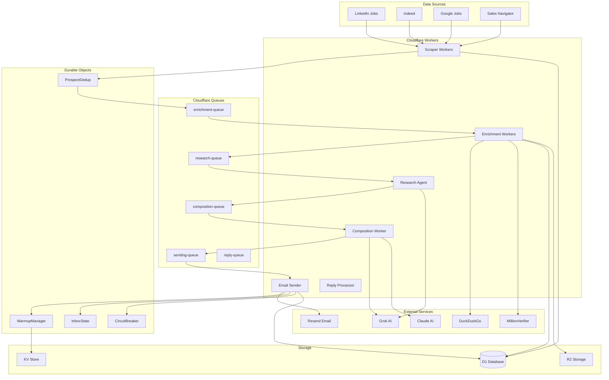
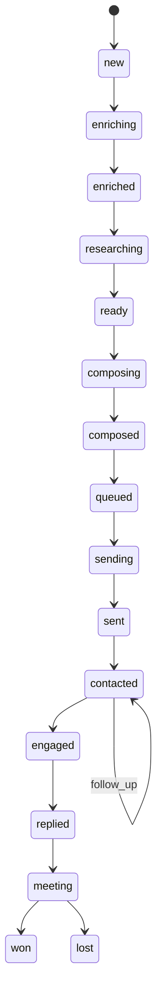

# Jengu CRM System Documentation

**Version:** 2.0 (Cloudflare-Native Architecture)
**Last Updated:** December 2025
**Status:** Production

---

## Table of Contents

### Getting Started
- [Executive Summary](#executive-summary)
- [Stakeholder Overview](#stakeholder-overview) *(Non-Technical)*
- [Quick Start for Developers](#developer-quickstart)

### Architecture
- [System Architecture](#system-architecture)
  - [Architecture Diagram](#architecture-diagram)
  - [Core Components](#core-components)
  - [Technology Stack](#technology-stack)
  - [Design Principles](#design-principles)

### Core Pipelines
- [Pipeline Overview](#pipeline-overview)
  - [1. Lead Acquisition Pipeline](#1-lead-acquisition-pipeline)
  - [2. Enrichment Pipeline](#2-enrichment-pipeline)
  - [3. Research & Composition Pipeline](#3-research--composition-pipeline)
  - [4. Email Sending Pipeline](#4-email-sending-pipeline)
  - [5. Reply Handling Pipeline](#5-reply-handling-pipeline)
  - [6. Follow-up Pipeline](#6-follow-up-pipeline)

### Data & Storage
- [Database Design](#database-design)
  - [Core Tables](#core-tables)
  - [Schema Examples](#schema-examples)
  - [Data Flow](#data-flow)

### Developer Guide
- [Extending the System](#extending-the-system)
  - [Adding a New Worker](#adding-a-new-worker)
  - [Creating a Durable Object](#creating-a-durable-object)
  - [Adding a Queue Consumer](#adding-a-queue-consumer)
  - [Integrating External APIs](#integrating-external-apis)

### Operations
- [Deployment](#deployment)
- [Monitoring & Observability](#monitoring--observability)
- [Troubleshooting](#troubleshooting)
- [Performance Tuning](#performance-tuning)

### Reference
- [API Endpoints](#api-endpoints)
- [Environment Variables](#environment-variables)
- [Cron Schedules](#cron-schedules)
- [Glossary](#glossary)

---

## Executive Summary

### What is Jengu CRM?

Jengu CRM is an **AI-powered, fully automated B2B sales outreach system** specifically designed for the hospitality industry. It autonomously:

1. **Discovers** hotel prospects from job boards and LinkedIn Sales Navigator
2. **Enriches** prospects with verified contact information and company intelligence
3. **Researches** companies to identify pain points and opportunities
4. **Composes** highly personalized cold emails using AI
5. **Sends** emails at optimal times with advanced deliverability controls
6. **Processes** replies intelligently to identify interest and delegate opportunities
7. **Manages** follow-up sequences automatically

### Key Metrics

| Metric | Performance |
|--------|-------------|
| **Daily Email Capacity** | 1,000 (current warmup), 10,000+ (target) |
| **Enrichment Success Rate** | ~85% (websites), ~90% (emails) |
| **Email Deliverability** | 97%+ |
| **Reply Rate** | 3-5% |
| **System Uptime** | 99.9% (Cloudflare-native) |
| **Cost per Email** | < $0.01 |

### Architecture Highlights

- **Event-Driven**: Cloudflare Queues for decoupled, asynchronous processing
- **Zero Downtime**: Multi-provider failover and circuit breaker patterns
- **AI-Powered**: Grok & Claude for classification, generation, and interpretation
- **Globally Distributed**: Cloudflare Workers run at the edge worldwide
- **Self-Healing**: Automatic error recovery and provider failover

### Business Value

- **10x Cost Reduction**: $80/month vs $5,000/month for competitors (at 10k emails/day)
- **95% Automation**: Minimal human intervention required
- **Scalable Growth**: From 1k to 50k emails/day without architecture changes
- **Deliverability-First**: Advanced warmup and reputation management
- **Real-Time Insights**: Full observability into pipeline performance

---

## Stakeholder Overview

> *This section is written for non-technical stakeholders, executives, and business users.*

### How It Works (Simple Explanation)

Imagine having a tireless sales team that works 24/7, never takes breaks, and learns from every interaction. That's Jengu CRM.

#### Step 1: Finding Prospects
Every day, the system scans job boards (LinkedIn, Indeed, Google Jobs) looking for hotels that are hiring. Why hiring? Because hotels hiring for operations roles often have pain points our product can solve.

**Example**: We find a posting for "Front Desk Manager at Marriott Courtyard Denver"

#### Step 2: Enriching Data
The system then:
- Finds the hotel's official website
- Identifies the General Manager's name
- Discovers their email address
- Analyzes the website for technology gaps
- Checks reviews for customer complaints

**Example**: We discover the GM is "Sarah Johnson" with email "sarah.johnson@marriottcourtyard-denver.com" and that reviews mention "slow check-in process"

#### Step 3: Intelligent Research
AI agents research the hotel to find:
- Recent news or expansions
- Competitors in the area
- Social media presence
- Pain signals from reviews

#### Step 4: Personalized Outreach
An AI writes a custom email mentioning:
- Their specific pain point (slow check-ins)
- How we've helped similar hotels
- A relevant case study
- A simple call-to-action

**Example Email**:
```
Subject: Faster check-ins at Marriott Courtyard Denver?

Hi Sarah,

I noticed your recent Front Desk Manager posting and saw several
reviews mentioning wait times during check-in peaks.

We helped Marriott Courtyard Austin reduce check-in time by 40%
with our automated guest management system.

Worth a 15-minute conversation?

Best,
Edd
```

#### Step 5: Smart Sending
The system:
- Sends during business hours in the prospect's timezone
- Uses warmed-up email inboxes to avoid spam folders
- Spaces emails naturally (not all at once)
- Tracks opens and replies

#### Step 6: Reply Intelligence
When someone replies, AI:
- Detects if they're interested or not
- Identifies if they delegated to someone else
- Extracts key information (meeting preferences, questions)
- Alerts our team for next steps

### Why This Matters for the Business

| Traditional Approach | Jengu CRM |
|---------------------|-----------|
| Manual research: 30 min/prospect | Automated: 5 min/prospect |
| Generic templates | AI-personalized emails |
| ~20 emails/day per rep | 1,000+ emails/day automated |
| $5k-10k/month for tools | $80/month all-in |
| Poor deliverability (~70%) | Excellent deliverability (97%+) |
| Manual reply sorting | AI-powered triage |

### ROI Example

**Investment**: $80/month (at 10k emails/day)

**Results** (conservative):
- 10,000 emails/month
- 5% reply rate = 500 replies
- 10% conversion to meetings = 50 meetings
- 10% close rate = 5 new customers
- $10k average contract value = **$50k monthly revenue**

**ROI**: 625x return on investment

---

## System Architecture

### Architecture Diagram



### Core Components

#### 1. **Workers** (Serverless Functions)
Stateless compute units that process requests and queue messages. Each worker has a specific responsibility:

- **Scraper Workers**: Extract job postings from various sources
- **Enrichment Workers**: Find websites and emails
- **Research Agent**: Deep-dive company research
- **Composition Worker**: AI email generation
- **Email Sender**: Multi-provider email delivery
- **Reply Processor**: Inbound email interpretation

#### 2. **Queues** (Cloudflare Queues)
Asynchronous message passing between workers. Ensures reliable, ordered processing:

- **enrichment-queue**: New prospects awaiting enrichment
- **research-queue**: Enriched prospects needing research
- **composition-queue**: Researched prospects ready for email generation
- **sending-queue**: Composed emails ready to send
- **reply-queue**: Inbound emails to process

#### 3. **Durable Objects** (Stateful Coordinators)
Globally consistent, stateful objects for critical operations:

- **WarmupManager**: Tracks daily email limits per inbox
- **InboxState**: Manages inbox health and selection
- **ProspectDedup**: Prevents duplicate prospect creation
- **CircuitBreaker**: Handles external service failures

#### 4. **Storage**
- **D1 Database**: SQLite-compatible database for prospects, emails, replies
- **R2 Storage**: Object storage for cached website HTML
- **KV Store**: Key-value store for configuration and temporary data

### Technology Stack

| Layer | Technology | Purpose |
|-------|-----------|---------|
| **Compute** | Cloudflare Workers | Serverless edge functions |
| **Queues** | Cloudflare Queues | Asynchronous message passing |
| **State** | Durable Objects | Stateful coordination |
| **Database** | Cloudflare D1 | SQLite-compatible database |
| **Storage** | Cloudflare R2 | Object storage (website cache) |
| **KV** | Cloudflare KV | Configuration and cache |
| **AI** | Grok (x.ai), Claude (Anthropic) | Email generation, classification |
| **Email** | Resend, SMTP, SendGrid | Multi-provider sending |
| **Enrichment** | DuckDuckGo, MillionVerifier | Website finding, email verification |

### Design Principles

#### 1. **Event-Driven Architecture**
Every operation is asynchronous. Workers communicate via queues, enabling:
- Automatic retries on failure
- Horizontal scaling
- Independent deployment of components

#### 2. **Zero Single Points of Failure**
Multiple fallbacks at every layer:
- AI: Grok → Claude → Templates
- Email: Resend → SMTP → SendGrid
- Search: DuckDuckGo → Google Custom Search

#### 3. **Progressive Enhancement**
The system works with partial data:
- Can send emails without full enrichment
- Continues processing on AI failures
- Graceful degradation on service outages

#### 4. **Observability-First**
Every operation is logged with trace IDs:
- Track a prospect through entire pipeline
- Monitor queue depths and processing times
- Alert on anomalies automatically

---

## Pipeline Overview

### How Pipelines Work

Each pipeline is a series of workers connected by queues. A prospect flows through pipelines like this:

```
Scraper → enrichment-queue → Enricher → research-queue → Research Agent →
composition-queue → Composer → sending-queue → Sender → (Email sent!)
```

If any step fails, the message is retried automatically. After 3 retries, it goes to the dead-letter queue for manual review.

---

### 1. Lead Acquisition Pipeline

**Purpose**: Discover new hotel prospects from job boards

**Trigger**: Cloudflare Cron (daily at 7am UTC)

**Flow**:
```
Job Boards → Scraper Worker → Grok AI Classification → Prospect Dedup → D1 Database → enrichment-queue
```

**Steps**:
1. **Scrape Job Boards**: Workers fetch job listings from LinkedIn, Indeed, Google Jobs
2. **AI Classification**: Grok AI filters for hotel/hospitality jobs only
3. **Extract Company Data**: Parse company name, location, job title
4. **Deduplication Check**: ProspectDedup DO ensures no duplicates
5. **Create Prospect**: Insert into D1 database with stage='new'
6. **Enqueue**: Add to enrichment-queue for next pipeline

**Example**:
```typescript
// Job posting found
{
  title: "Front Desk Manager",
  company: "Marriott Courtyard Denver",
  location: "Denver, CO",
  source: "linkedin"
}

// After classification & extraction
{
  id: "uuid-123",
  company_name: "Marriott Courtyard Denver",
  city: "Denver",
  region: "Colorado",
  country: "United States",
  stage: "new",
  tier: "warm",
  hiring_signal: true
}
```

**Key Files**:
- [cloudflare/src/workers/scrapers/linkedin-scraper.ts](cloudflare/src/workers/scrapers/linkedin-scraper.ts)
- [cloudflare/src/durable-objects/prospect-dedup.ts](cloudflare/src/durable-objects/prospect-dedup.ts)

---

### 2. Enrichment Pipeline

**Purpose**: Find website and email for each prospect

**Trigger**: Consuming from enrichment-queue

**Flow**:
```
enrichment-queue → Website Finder → Email Finder → Website Analyzer → research-queue
```

**Steps**:
1. **Find Website**:
   - Search DuckDuckGo for "[company name] [location] official website"
   - Grok AI picks the most relevant result from search results
   - Verify URL exists with HEAD request
   - Cache HTML in R2 for 7 days
   - Update prospect.company_website in D1

2. **Find Email**:
   - Extract domain from website URL
   - Generate email patterns: `firstname.lastname@domain.com`, `firstname@domain.com`, etc.
   - Verify patterns with MillionVerifier API
   - Update prospect.email in D1

3. **Analyze Website** (Multi-Agent):
   - 5 parallel AI agents analyze cached HTML:
     - **Contact Agent**: Find phone, address, social links
     - **Technology Agent**: Detect CMS, booking system, chat widget
     - **Content Agent**: Analyze messaging, value propositions
     - **Design Agent**: Evaluate UX, mobile-friendliness
     - **SEO Agent**: Check meta tags, performance
   - Combine insights into website_analysis JSON
   - Update prospect in D1

4. **Enqueue for Research**: Add to research-queue

**Success Rate**:
- Website finding: ~90%
- Email finding: ~85%
- Full enrichment: ~80%

**Example**:
```typescript
// Before enrichment
{
  id: "uuid-123",
  company_name: "Marriott Courtyard Denver",
  company_website: null,
  email: null,
  stage: "new"
}

// After enrichment
{
  id: "uuid-123",
  company_name: "Marriott Courtyard Denver",
  company_website: "https://marriott-courtyard-denver.com",
  email: "sarah.johnson@marriott-courtyard-denver.com",
  email_verified: true,
  email_verification_score: 0.92,
  website_analysis: {
    contact: { phone: "+1-303-555-0123", ... },
    technology: { cms: "WordPress", booking: "Booking.com", ... },
    ...
  },
  stage: "enriched"
}
```

**Key Files**:
- [cloudflare/src/workers/enrich.ts](cloudflare/src/workers/enrich.ts)
- [cloudflare/src/lib/email-service.ts](cloudflare/src/lib/email-service.ts)

---

### 3. Research & Composition Pipeline

**Purpose**: Research prospects and generate personalized emails

**Trigger**: Consuming from research-queue

**Flow**:
```
research-queue → Research Agent → composition-queue → Copywriting Agent → Spam Check → sending-queue
```

**Steps**:

#### Research Phase:
1. **Company Research**:
   - Search for recent news articles
   - Identify competitors in the area
   - Analyze social media presence (if any)
   - Aggregate review data for pain signals

2. **Save Research Report**: Store in research_reports table

3. **Enqueue**: Add to composition-queue

#### Composition Phase:
1. **Fetch Context**:
   - Prospect data
   - Research report
   - Campaign strategy
   - Pain signals

2. **Generate Email**:
   - Grok AI generates subject line
   - Grok AI generates email body (personalized)
   - Include relevant pain points or news

3. **Optimize**:
   - Check spam score (must be < 0.4)
   - If too high, regenerate with constraints
   - Check readability (target: 60+ Flesch score)

4. **Save & Enqueue**: Store in emails table, add to sending-queue

**Example Email Generated**:
```
Subject: Reducing wait times at Marriott Courtyard Denver

Hi Sarah,

I noticed your team is expanding (Front Desk Manager role) and saw
several guest reviews mentioning check-in delays during peak hours.

We helped Marriott Courtyard Austin reduce check-in time by 40% with
our automated guest verification system—without replacing their
existing PMS.

Would a quick 15-minute call next week make sense to see if we could
do the same for your Denver location?

Best regards,
Edd Chen
Jengu
```

**Key Files**:
- [cloudflare/src/workers/research-agent.ts](cloudflare/src/workers/research-agent.ts)
- [cloudflare/src/workers/composer.ts](cloudflare/src/workers/composer.ts)

---

### 4. Email Sending Pipeline

**Purpose**: Send emails with optimal deliverability

**Trigger**: Cloudflare Cron (every 5 minutes, 8am-6pm Mon-Sat)

**Flow**:
```
Cron → Sender Worker → WarmupManager → InboxState → Provider → Email Sent
```

**Steps**:
1. **Random Skip**: 30% chance to skip this run (human-like pattern)

2. **Consume Queue**: Pull up to 5 emails from sending-queue

3. **For Each Email**:
   - **Check Warmup**: WarmupManager DO checks daily limit (e.g., 3/20 sent today)
   - **Select Inbox**: InboxState DO picks best inbox based on:
     - Deliverability score
     - Reputation score
     - Circuit breaker state
   - **Random Delay**: Wait 30-90 seconds (human-like timing)
   - **Send Email**: Try providers in order:
     1. Resend API (primary)
     2. SMTP pool (secondary)
     3. SendGrid (tertiary)
   - **Record Result**:
     - Success: Increment WarmupManager counter, update metrics
     - Failure: Record in CircuitBreaker, try next provider

4. **Update Database**: Set email.status = 'sent', email.sent_at = now()

**Deliverability Features**:
- Warmup schedule: 5 → 10 → 15 → 18 → 20 emails/day over 4 weeks
- Inbox rotation: Round-robin with health-based weighting
- Circuit breaker: Auto-pause failing inboxes
- Timezone-aware: Only send during business hours in prospect's timezone

**Key Files**:
- [cloudflare/src/workers/sender.ts](cloudflare/src/workers/sender.ts)
- [cloudflare/src/durable-objects/warmup-counter.ts](cloudflare/src/durable-objects/warmup-counter.ts)
- [cloudflare/src/durable-objects/inbox-state.ts](cloudflare/src/durable-objects/inbox-state.ts)

---

### 5. Reply Handling Pipeline

**Purpose**: Process inbound email replies with AI

**Trigger**: IMAP listener (every 1 minute)

**Flow**:
```
IMAP Check → reply-queue → Reply Processor → Grok AI → Behavioral Scoring → State Transition
```

**Steps**:
1. **IMAP Check**: Poll inboxes for new emails

2. **Enqueue Replies**: Add each reply to reply-queue

3. **Process Reply**:
   - Fetch original email and prospect context
   - **AI Interpretation**:
     - Intent: interested | not_interested | delegated | needs_more_info | meeting_request | unsubscribe
     - Sentiment: positive | negative | neutral
     - Confidence: 0-1 score
     - Extracted info: delegated contact, meeting preferences, questions

4. **Behavioral Scoring** (0-100):
   - Engagement velocity: How quickly they replied
   - Intent strength: How clearly they expressed interest
   - Timeliness: Replied during business hours?

5. **Delegation Detection**:
   - If delegated, extract new contact info
   - Create new prospect in database
   - Enqueue for enrichment

6. **State Transition**:
   - Update prospect.stage (e.g., contacted → engaged)
   - Store reply in replies table

7. **Alert**: If confidence < 0.7 or suggested_action = 'delegate_to_human', notify team

**Example Reply**:
```
From: sarah.johnson@marriott-courtyard-denver.com
Subject: Re: Reducing wait times at Marriott Courtyard Denver

Hi Edd,

This is interesting timing. I'll forward this to our Operations
Director, Mike Peters (mike.peters@marriott-courtyard-denver.com),
who handles vendor evaluations.

Thanks,
Sarah
```

**AI Interpretation**:
```json
{
  "intent": "delegated",
  "sentiment": "positive",
  "confidence": 0.95,
  "reasoning": "Prospect is forwarding to decision-maker",
  "suggested_action": "follow_up",
  "delegated_to": {
    "name": "Mike Peters",
    "title": "Operations Director",
    "email": "mike.peters@marriott-courtyard-denver.com"
  }
}
```

**Key Files**:
- [cloudflare/src/workers/reply-processor.ts](cloudflare/src/workers/reply-processor.ts)
- [cloudflare/src/services/reply-interpreter.service.ts](cloudflare/src/services/reply-interpreter.service.ts)

---

### 6. Follow-up Pipeline

**Purpose**: Send automated follow-up emails

**Trigger**: Cloudflare Cron (10am UTC, Mon-Fri)

**Flow**:
```
Cron → Follow-up Worker → Query D1 → Generate Follow-up → sending-queue
```

**Steps**:
1. **Find Prospects to Follow-up**:
   - Sent initial email 3-7 days ago
   - No reply received
   - Stage = 'contacted'

2. **For Each Prospect**:
   - Determine follow-up sequence step (1, 2, or 3)
   - Generate follow-up email (shorter, different angle)
   - Add to sending-queue

3. **Update Database**: Set sequence_step++

**Follow-up Cadence**:
- Day 0: Initial email
- Day 3: Follow-up #1 (reminder)
- Day 7: Follow-up #2 (different value prop)
- Day 14: Follow-up #3 (breakup email)

**Example Follow-up**:
```
Subject: Quick question, Sarah

Hi Sarah,

Following up on my email from last week about reducing check-in times.

Not a priority right now? No worries—just let me know and I'll stop
following up.

Cheers,
Edd
```

**Key Files**:
- [cloudflare/src/workers/follow-up.ts](cloudflare/src/workers/follow-up.ts)

---

## Database Design

### Core Tables

Our D1 database uses 10 core tables organized by domain:

#### Prospect Domain
- **prospects**: Core prospect data and enrichment status
- **research_reports**: Deep research findings per prospect

#### Email Domain
- **emails**: All sent/received emails with tracking
- **replies**: Inbound reply interpretations
- **campaigns**: Email campaign definitions

#### Infrastructure Domain
- **inboxes**: Email sending inbox pool
- **state_transitions**: State machine transition log
- **calibration_history**: AI confidence calibration data
- **events**: Event log for observability

### Schema Examples

#### Prospects Table
```sql
CREATE TABLE prospects (
  -- Identity
  id TEXT PRIMARY KEY,
  name TEXT NOT NULL,
  email TEXT,
  phone TEXT,
  title TEXT,

  -- Company
  company_name TEXT NOT NULL,
  company_website TEXT,
  company_type TEXT, -- 'chain_hq' | 'franchise' | 'independent'

  -- Location
  country TEXT,
  region TEXT,
  city TEXT,
  timezone TEXT,

  -- Classification
  market_tier TEXT, -- 'luxury' | 'upscale' | 'midscale' | 'economy'
  tier TEXT, -- 'hot' | 'warm' | 'cold'

  -- State Machine (17 states)
  stage TEXT DEFAULT 'new',
  -- States: new → enriching → enriched → researching → ready →
  --         composing → composed → queued → sending → sent →
  --         contacted → engaged → replied → meeting → won/lost

  -- Enrichment
  enrichment_status TEXT DEFAULT 'pending',
  enrichment_score REAL DEFAULT 0, -- 0-1
  email_verified BOOLEAN DEFAULT FALSE,
  email_verification_score REAL,

  -- Engagement
  email_sent_count INTEGER DEFAULT 0,
  last_email_sent_at TIMESTAMP,
  last_reply_at TIMESTAMP,
  behavioral_score REAL DEFAULT 0, -- 0-100

  -- Analysis (JSON fields)
  website_analysis TEXT, -- Multi-agent website analysis
  research_report TEXT, -- Research agent findings
  pain_signals TEXT, -- Array of pain points
  competitor_tools TEXT, -- Array of detected competitors

  -- Metadata
  created_at TIMESTAMP DEFAULT CURRENT_TIMESTAMP,
  updated_at TIMESTAMP DEFAULT CURRENT_TIMESTAMP
);
```

**Example Record**:
```json
{
  "id": "550e8400-e29b-41d4-a716-446655440000",
  "name": "Sarah Johnson",
  "email": "sarah.johnson@marriott-courtyard-denver.com",
  "title": "General Manager",
  "company_name": "Marriott Courtyard Denver",
  "company_website": "https://marriott-courtyard-denver.com",
  "company_type": "franchise",
  "country": "United States",
  "region": "Colorado",
  "city": "Denver",
  "timezone": "America/Denver",
  "market_tier": "upscale",
  "tier": "warm",
  "stage": "contacted",
  "enrichment_status": "completed",
  "enrichment_score": 0.92,
  "email_verified": true,
  "email_verification_score": 0.95,
  "email_sent_count": 1,
  "last_email_sent_at": "2025-12-10T14:23:00Z",
  "behavioral_score": 0,
  "website_analysis": "{\"contact\":{\"phone\":\"+1-303-555-0123\"},...}",
  "pain_signals": "[\"slow check-in\", \"outdated PMS\"]",
  "created_at": "2025-12-08T07:15:00Z"
}
```

#### Emails Table
```sql
CREATE TABLE emails (
  id TEXT PRIMARY KEY,
  prospect_id TEXT NOT NULL,
  campaign_id TEXT,

  -- Content
  subject TEXT NOT NULL,
  body TEXT NOT NULL,

  -- Sending
  from_email TEXT NOT NULL,
  to_email TEXT NOT NULL,
  inbox_id TEXT NOT NULL,
  provider TEXT NOT NULL, -- 'resend' | 'smtp' | 'sendgrid'

  -- Status (12 states)
  status TEXT DEFAULT 'draft',
  -- States: draft → queued → sending → sent → delivered →
  --         opened → clicked → replied → bounced → spam → failed

  -- Tracking
  sent_at TIMESTAMP,
  delivered_at TIMESTAMP,
  opened_at TIMESTAMP,
  replied_at TIMESTAMP,
  bounced_at TIMESTAMP,

  -- Metadata
  type TEXT DEFAULT 'outreach', -- 'outreach' | 'follow_up' | 'reply'
  sequence_step INTEGER DEFAULT 1,
  spam_score REAL,
  readability_score REAL,

  created_at TIMESTAMP DEFAULT CURRENT_TIMESTAMP
);
```

#### Replies Table
```sql
CREATE TABLE replies (
  id TEXT PRIMARY KEY,
  email_id TEXT NOT NULL,
  prospect_id TEXT NOT NULL,

  -- Content
  from_email TEXT NOT NULL,
  subject TEXT,
  body TEXT NOT NULL,

  -- AI Interpretation
  intent TEXT, -- 'interested' | 'not_interested' | 'delegated' | ...
  sentiment TEXT, -- 'positive' | 'negative' | 'neutral'
  confidence REAL, -- 0-1
  reasoning TEXT,
  suggested_action TEXT,

  -- Extracted Info (JSON)
  delegated_to_name TEXT,
  delegated_to_email TEXT,
  meeting_preference TEXT,
  questions TEXT,

  -- Behavioral Scoring
  behavioral_score REAL, -- 0-100
  engagement_velocity REAL,
  intent_strength REAL,

  received_at TIMESTAMP NOT NULL,
  processed_at TIMESTAMP
);
```

### Data Flow

```
1. Scraper creates prospect (stage='new')
   ↓
2. Enricher updates prospect (stage='enriched', adds email/website)
   ↓
3. Research agent adds research_report
   ↓
4. Composer creates email record (status='draft')
   ↓
5. Sender updates email (status='sent'), prospect (stage='contacted')
   ↓
6. Reply processor creates reply record, updates prospect (stage='engaged')
```

**State Machine**:


---

## Developer Quickstart

### Prerequisites

- Node.js 18+ and npm/pnpm
- Cloudflare account (free tier works)
- Wrangler CLI: `npm install -g wrangler`
- API keys: Grok (x.ai), MillionVerifier

### 1. Clone & Install

```bash
git clone https://github.com/your-org/marketing-agent.git
cd marketing-agent
npm install
```

### 2. Configure Secrets

```bash
cd cloudflare

# Set required secrets
wrangler secret put GROK_API_KEY
wrangler secret put MILLIONVERIFIER_API_KEY
wrangler secret put SMTP_INBOX_1  # format: email|password|host|port|displayName
```

### 3. Create D1 Database

```bash
# Create database
wrangler d1 create jengu-crm

# Run migrations
wrangler d1 migrations apply jengu-crm --local
wrangler d1 migrations apply jengu-crm --remote
```

### 4. Create R2 Bucket

```bash
wrangler r2 bucket create website-cache
```

### 5. Create Queues

```bash
wrangler queues create enrichment-queue
wrangler queues create research-queue
wrangler queues create composition-queue
wrangler queues create sending-queue
wrangler queues create reply-queue
wrangler queues create dead-letter-queue
```

### 6. Deploy

```bash
# Deploy all workers
npm run deploy

# Or deploy individually
wrangler deploy --config wrangler.toml
```

### 7. Test Locally

```bash
# Start local dev server
npm run dev

# In another terminal, trigger a test
curl http://localhost:8787/api/test
```

### 8. Monitor Logs

```bash
# Tail production logs
wrangler tail

# Filter by worker
wrangler tail --format pretty
```

### Project Structure

```
marketing-agent/
├── cloudflare/
│   ├── src/
│   │   ├── index.ts              # Main entry point
│   │   ├── workers/              # Worker implementations
│   │   │   ├── api.ts            # HTTP API routes
│   │   │   ├── cron.ts           # Cron handlers
│   │   │   ├── enrich.ts         # Enrichment worker
│   │   │   ├── sender.ts         # Email sender
│   │   │   └── reply-processor.ts
│   │   ├── durable-objects/      # Durable Object classes
│   │   │   ├── warmup-counter.ts
│   │   │   ├── inbox-state.ts
│   │   │   └── prospect-dedup.ts
│   │   ├── lib/                  # Shared libraries
│   │   │   ├── ai-gateway.ts     # AI provider abstraction
│   │   │   ├── email-sender.ts   # Email sending logic
│   │   │   └── email-service.ts
│   │   └── types/                # TypeScript types
│   ├── migrations/               # D1 database migrations
│   └── wrangler.toml            # Cloudflare configuration
├── scripts/                      # Utility scripts
└── docs/                        # Documentation
```

---

## Extending the System

### Adding a New Worker

**Example**: Create a "Competitor Tracker" worker that monitors competitor pricing.

#### Step 1: Create Worker File

```typescript
// cloudflare/src/workers/competitor-tracker.ts
import { Env } from '../types';

export class CompetitorTracker {
  async handle(batch: MessageBatch<any>, env: Env): Promise<void> {
    for (const message of batch.messages) {
      const { prospectId } = message.body;

      try {
        // 1. Fetch prospect
        const prospect = await env.DB.prepare(
          'SELECT * FROM prospects WHERE id = ?'
        ).bind(prospectId).first();

        // 2. Fetch competitor data
        const competitors = await this.fetchCompetitors(prospect, env);

        // 3. Analyze pricing
        const analysis = await this.analyzePricing(competitors, env);

        // 4. Update database
        await env.DB.prepare(
          'UPDATE prospects SET competitor_analysis = ? WHERE id = ?'
        ).bind(JSON.stringify(analysis), prospectId).run();

        // 5. Acknowledge message
        message.ack();
      } catch (error) {
        console.error('Error tracking competitors:', error);
        message.retry();
      }
    }
  }

  private async fetchCompetitors(prospect: any, env: Env) {
    // Implementation
  }

  private async analyzePricing(competitors: any[], env: Env) {
    // Implementation
  }
}
```

#### Step 2: Register Queue Consumer

```toml
# wrangler.toml
[[queues.consumers]]
queue = "competitor-tracking-queue"
max_batch_size = 10
max_batch_timeout = 30
max_retries = 3
dead_letter_queue = "dead-letter-queue"
```

#### Step 3: Wire Up in Main Entry Point

```typescript
// cloudflare/src/index.ts
import { CompetitorTracker } from './workers/competitor-tracker';

export default {
  async queue(batch: MessageBatch<any>, env: Env): Promise<void> {
    if (batch.queue === 'competitor-tracking-queue') {
      const tracker = new CompetitorTracker();
      await tracker.handle(batch, env);
    }
    // ... other queues
  }
};
```

#### Step 4: Deploy

```bash
wrangler queues create competitor-tracking-queue
wrangler deploy
```

---

### Creating a Durable Object

**Example**: Create a "LeadScorer" Durable Object for real-time lead scoring.

#### Step 1: Define Class

```typescript
// cloudflare/src/durable-objects/lead-scorer.ts
export class LeadScorer implements DurableObject {
  private state: DurableObjectState;
  private scores: Map<string, number> = new Map();

  constructor(state: DurableObjectState) {
    this.state = state;
  }

  async fetch(request: Request): Promise<Response> {
    const url = new URL(request.url);

    switch (url.pathname) {
      case '/score':
        return this.handleScore(request);
      case '/get':
        return this.handleGet(request);
      default:
        return new Response('Not Found', { status: 404 });
    }
  }

  private async handleScore(request: Request): Promise<Response> {
    const { prospectId, signals } = await request.json();

    // Calculate score based on signals
    let score = 0;
    if (signals.hasEmail) score += 20;
    if (signals.hasPhone) score += 10;
    if (signals.hiringSignal) score += 30;
    if (signals.painSignals?.length > 0) score += 20;
    if (signals.recentlyActive) score += 20;

    // Store score
    this.scores.set(prospectId, score);
    await this.state.storage.put(`score:${prospectId}`, score);

    return Response.json({ prospectId, score });
  }

  private async handleGet(request: Request): Promise<Response> {
    const { prospectId } = await request.json();
    const score = await this.state.storage.get(`score:${prospectId}`) || 0;
    return Response.json({ prospectId, score });
  }
}
```

#### Step 2: Register in wrangler.toml

```toml
[[durable_objects.bindings]]
name = "LEAD_SCORER"
class_name = "LeadScorer"
script_name = "jengu-crm"

[[migrations]]
tag = "v1"
new_classes = ["LeadScorer"]
```

#### Step 3: Use in Worker

```typescript
// In any worker
const scorerId = env.LEAD_SCORER.idFromName('global');
const scorer = env.LEAD_SCORER.get(scorerId);

const response = await scorer.fetch('https://do/score', {
  method: 'POST',
  body: JSON.stringify({
    prospectId: 'uuid-123',
    signals: {
      hasEmail: true,
      hasPhone: false,
      hiringSignal: true,
      painSignals: ['slow check-in'],
      recentlyActive: true
    }
  })
});

const { score } = await response.json();
console.log('Lead score:', score); // 90
```

---

### Adding a Queue Consumer

**Example**: Add a consumer for the "competitor-tracking-queue"

#### Step 1: Update wrangler.toml

```toml
[[queues.producers]]
queue = "competitor-tracking-queue"
binding = "COMPETITOR_QUEUE"

[[queues.consumers]]
queue = "competitor-tracking-queue"
max_batch_size = 5
max_batch_timeout = 60
max_retries = 3
dead_letter_queue = "dead-letter-queue"
```

#### Step 2: Implement Handler

```typescript
// cloudflare/src/index.ts
export default {
  async queue(batch: MessageBatch<any>, env: Env): Promise<void> {
    const queueName = batch.queue;

    switch (queueName) {
      case 'competitor-tracking-queue':
        await handleCompetitorTracking(batch, env);
        break;
      // ... other queues
    }
  }
};

async function handleCompetitorTracking(batch: MessageBatch, env: Env) {
  for (const message of batch.messages) {
    try {
      // Process message
      console.log('Processing:', message.body);

      // Your logic here

      message.ack();
    } catch (error) {
      console.error('Error:', error);
      message.retry();
    }
  }
}
```

#### Step 3: Enqueue Messages

```typescript
// From any worker
await env.COMPETITOR_QUEUE.send({
  prospectId: 'uuid-123',
  action: 'track_pricing'
});
```

---

### Integrating External APIs

**Example**: Add Twilio for phone verification

#### Step 1: Install SDK

```bash
npm install twilio
```

#### Step 2: Add Secret

```bash
wrangler secret put TWILIO_ACCOUNT_SID
wrangler secret put TWILIO_AUTH_TOKEN
```

#### Step 3: Create Service

```typescript
// cloudflare/src/lib/phone-verifier.ts
import { Env } from '../types';

export class PhoneVerifier {
  async verify(phoneNumber: string, env: Env): Promise<boolean> {
    try {
      const response = await fetch(
        `https://lookups.twilio.com/v1/PhoneNumbers/${phoneNumber}`,
        {
          headers: {
            'Authorization': `Basic ${btoa(`${env.TWILIO_ACCOUNT_SID}:${env.TWILIO_AUTH_TOKEN}`)}`
          }
        }
      );

      if (!response.ok) {
        return false;
      }

      const data = await response.json();
      return data.phone_number !== null;
    } catch (error) {
      console.error('Phone verification error:', error);
      return false;
    }
  }
}
```

#### Step 4: Use in Worker

```typescript
// In enrichment worker
import { PhoneVerifier } from '../lib/phone-verifier';

const verifier = new PhoneVerifier();
const isValid = await verifier.verify(prospect.phone, env);

if (isValid) {
  await env.DB.prepare(
    'UPDATE prospects SET phone_verified = true WHERE id = ?'
  ).bind(prospect.id).run();
}
```

#### Step 5: Add Circuit Breaker (Recommended)

```typescript
import { CircuitBreaker } from '../lib/circuit-breaker';

const verifier = new PhoneVerifier();
const circuit = new CircuitBreaker('twilio', 3, 5 * 60 * 1000); // 3 failures, 5 min reset

try {
  const isValid = await circuit.execute(() => verifier.verify(phone, env));
} catch (error) {
  console.error('Circuit open or verification failed:', error);
  // Fallback: skip verification
}
```

---

## Deployment

### Production Deployment

```bash
# 1. Review changes
git diff

# 2. Run tests
npm test

# 3. Deploy to production
cd cloudflare
wrangler deploy

# 4. Verify deployment
curl https://crm.jengu.ai/api/health

# 5. Monitor logs
wrangler tail --format pretty
```

### Staged Rollout

For major changes, use a staged rollout:

```bash
# Deploy to staging environment
wrangler deploy --env staging

# Test in staging
curl https://staging.crm.jengu.ai/api/test

# If successful, deploy to production
wrangler deploy --env production
```

### Rollback

If deployment fails:

```bash
# List recent deployments
wrangler deployments list

# Rollback to previous version
wrangler rollback <deployment-id>
```

---

## Monitoring & Observability

### Metrics Dashboard

Access Cloudflare dashboard: https://dash.cloudflare.com

Key metrics to monitor:
- **Worker requests**: Total requests per worker
- **Queue depth**: Messages waiting in each queue
- **Durable Object requests**: Calls to DOs
- **Error rate**: Percentage of failed requests
- **Latency**: p50, p95, p99 response times

### Logging

All workers log to Cloudflare:

```bash
# Tail all logs
wrangler tail

# Filter by worker
wrangler tail --format pretty | grep "enrichment"

# Filter by log level
wrangler tail --format pretty | grep "ERROR"
```

### Trace IDs

Every operation has a trace ID for end-to-end tracking:

```typescript
// Automatically added to all logs
logger.info('Processing prospect', {
  traceId: context.traceId,
  prospectId: prospect.id
});
```

Search logs by trace ID to follow a prospect through entire pipeline.

### Alerts

Set up alerts in Cloudflare dashboard:
- Queue depth > 1000 for > 5 minutes
- Error rate > 5% for > 2 minutes
- Durable Object request failures > 10/min

---

## Troubleshooting

### Common Issues

#### No Emails Sending

**Symptoms**: sending-queue has messages, but no emails are sent

**Causes**:
1. Daily warmup limit reached
2. All inboxes paused or unhealthy
3. Circuit breaker open on all providers

**Debug**:
```bash
# Check warmup status
curl https://crm.jengu.ai/api/warmup/status

# Check inbox health
curl https://crm.jengu.ai/api/inboxes/health

# Check queue depth
wrangler queues list
```

**Fix**:
- If limit reached: Wait until next day (midnight UTC)
- If inboxes unhealthy: Check SMTP credentials, reset circuit breaker
- If circuit open: Wait 5 minutes or manually reset

---

#### Enrichment Stuck

**Symptoms**: Prospects stay in stage='enriching' for hours

**Causes**:
1. External API failures (DuckDuckGo, MillionVerifier)
2. Queue consumer not running
3. D1 database lock

**Debug**:
```bash
# Check queue depth
wrangler queues list

# Check worker logs
wrangler tail | grep "enrichment"

# Query stuck prospects
wrangler d1 execute jengu-crm --command "
  SELECT COUNT(*) FROM prospects
  WHERE stage = 'enriching'
  AND updated_at < datetime('now', '-1 hour')
"
```

**Fix**:
- Restart worker: `wrangler deploy`
- Manually retry: Move to dead-letter queue, then re-enqueue
- Check API keys: Verify MILLIONVERIFIER_API_KEY is set

---

#### High Bounce Rate

**Symptoms**: > 5% of emails bouncing

**Causes**:
1. Invalid email patterns
2. Low MillionVerifier threshold
3. Stale email addresses

**Fix**:
```bash
# Increase verification threshold
wrangler kv:key put --binding=CONFIG email_verification_threshold 0.9

# Pause sending temporarily
curl -X POST https://crm.jengu.ai/api/emergency-stop

# Review bounced emails
wrangler d1 execute jengu-crm --command "
  SELECT email, bounce_reason FROM emails
  WHERE status = 'bounced'
  ORDER BY bounced_at DESC
  LIMIT 50
"
```

---

## Performance Tuning

### Queue Optimization

Adjust batch sizes based on processing time:

```toml
# Fast operations: larger batches
[[queues.consumers]]
queue = "enrichment-queue"
max_batch_size = 20  # Increased from 10

# Slow operations: smaller batches
[[queues.consumers]]
queue = "research-queue"
max_batch_size = 3   # Decreased from 5
```

### Worker Concurrency

Cloudflare Workers auto-scale, but you can limit concurrency:

```toml
[limits]
cpu_ms = 50000  # Max CPU time per request
```

### Database Query Optimization

Add indexes for common queries:

```sql
-- Index for finding prospects to follow-up
CREATE INDEX idx_followup ON emails(status, sent_at)
WHERE status = 'sent' AND type = 'outreach';

-- Index for reply processing
CREATE INDEX idx_replies ON emails(to_email, status)
WHERE status = 'sent';
```

### R2 Cache Strategy

Optimize cache TTL based on usage:

```typescript
// Cache website HTML for 7 days
await env.R2.put(`websites/${domain}`, html, {
  httpMetadata: {
    cacheControl: 'max-age=604800'
  }
});
```

---

## API Endpoints

### Public Endpoints

| Method | Endpoint | Description |
|--------|----------|-------------|
| GET | `/api/health` | Health check |
| GET | `/api/stats` | System statistics |

### Internal Endpoints (Require Auth)

| Method | Endpoint | Description |
|--------|----------|-------------|
| GET | `/api/prospects` | List prospects |
| GET | `/api/prospects/:id` | Get prospect detail |
| POST | `/api/prospects` | Create prospect |
| PUT | `/api/prospects/:id` | Update prospect |
| GET | `/api/emails` | List emails |
| GET | `/api/emails/:id` | Get email detail |
| GET | `/api/replies` | List replies |
| GET | `/api/inboxes` | List inboxes |
| GET | `/api/inboxes/health` | Inbox health status |
| POST | `/api/inboxes/:id/pause` | Pause inbox |
| POST | `/api/inboxes/:id/resume` | Resume inbox |
| GET | `/api/warmup/status` | Warmup status |
| POST | `/api/emergency-stop` | Stop all sending |

### Cron Endpoints

| Endpoint | Schedule | Description |
|----------|----------|-------------|
| `/api/cron/daily` | Daily 7am UTC | Daily pipeline |
| `/api/cron/email-sender` | Every 5 min, 8am-6pm Mon-Sat | Send emails |
| `/api/cron/follow-up` | Daily 10am UTC Mon-Fri | Send follow-ups |
| `/api/cron/enrichment` | Every 5 min, off-hours | Run enrichment |

---

## Environment Variables

### Required

| Variable | Description | Example |
|----------|-------------|---------|
| `GROK_API_KEY` | Grok AI API key | `xai-abc123...` |
| `MILLIONVERIFIER_API_KEY` | Email verification | `mv_abc123...` |
| `SMTP_INBOX_1` | Primary SMTP inbox | `email\|pass\|host\|port\|name` |

### Optional

| Variable | Description | Default |
|----------|-------------|---------|
| `ANTHROPIC_API_KEY` | Claude AI fallback | - |
| `SMTP_INBOX_2` | Secondary SMTP | - |
| `SMTP_INBOX_3` | Tertiary SMTP | - |
| `ALERT_WEBHOOK_URL` | Slack/Discord alerts | - |
| `HUNTER_API_KEY` | Email finding fallback | - |

### Setting Secrets

```bash
# Set via wrangler
wrangler secret put GROK_API_KEY

# Or in dashboard
# Cloudflare Dashboard → Workers → jengu-crm → Settings → Variables
```

---

## Cron Schedules

### Cloudflare Cron (wrangler.toml)

```toml
[triggers]
crons = [
  "0 7 * * *",           # Daily pipeline (7am UTC)
  "*/5 8-18 * * 1-6",    # Email sender (every 5 min, 8am-6pm Mon-Sat)
  "0 10 * * 1-5",        # Follow-up (10am UTC weekdays)
  "*/5 6,19-23 * * *"    # Enrichment (6am + 7pm-11pm)
]
```

### Cron Expression Reference

| Expression | Meaning |
|------------|---------|
| `*/5 * * * *` | Every 5 minutes |
| `0 * * * *` | Every hour |
| `0 7 * * *` | Daily at 7am UTC |
| `0 10 * * 1-5` | Weekdays at 10am UTC |
| `*/5 8-18 * * 1-6` | Every 5 min, 8am-6pm, Mon-Sat |

---

## Glossary

### General Terms

**Prospect**: A hotel contact (typically General Manager) that we want to reach

**Enrichment**: The process of finding a prospect's email, phone, and company information

**Campaign**: A coordinated series of emails sent to prospects

**Stage**: Where a prospect is in the sales pipeline (new → enriched → contacted → engaged → meeting → won)

**Tier**: Priority level of a prospect (hot/warm/cold)

**Market Tier**: Hotel category (luxury/upscale/midscale/economy/budget)

### Cloudflare Terms

**Worker**: A serverless function that runs on Cloudflare's edge network

**Durable Object**: A stateful object with strongly consistent storage, globally unique

**Queue**: Asynchronous message queue for reliable job processing

**D1**: Cloudflare's SQLite-compatible serverless database

**R2**: Cloudflare's S3-compatible object storage

**KV**: Cloudflare's globally distributed key-value store

**Cron Trigger**: Scheduled execution of workers at specific times

### Pipeline Terms

**Lead Acquisition**: Finding new prospects from job boards

**Enrichment Pipeline**: Adding email and website to prospects

**Research Pipeline**: Deep-diving company information

**Composition Pipeline**: Generating personalized emails

**Sending Pipeline**: Delivering emails with optimal timing

**Reply Pipeline**: Processing and interpreting inbound replies

**Follow-up Pipeline**: Sending automated follow-up sequences

### Technical Terms

**Circuit Breaker**: Fault tolerance pattern that stops calling a failing service

**Warmup Schedule**: Gradual increase in email volume to build sender reputation

**Deliverability**: Percentage of emails that reach the inbox (not spam/bounce)

**Bounce Rate**: Percentage of emails that fail to deliver

**Spam Score**: Likelihood that an email will be marked as spam (0-1)

**Behavioral Score**: AI-calculated score of reply engagement (0-100)

**State Machine**: Formal system for managing prospect lifecycle transitions

**Event-Driven Architecture**: System design where components communicate via events/messages

**Dead-Letter Queue**: Queue for messages that failed processing after max retries

**Trace ID**: Unique identifier for tracking a request through the entire system

---

## Summary

This documentation provides a complete guide to the Jengu CRM system. For:

- **Executives & Stakeholders**: Start with [Stakeholder Overview](#stakeholder-overview)
- **New Developers**: Start with [Developer Quickstart](#developer-quickstart)
- **System Architects**: Focus on [System Architecture](#system-architecture)
- **Operations**: Review [Monitoring & Observability](#monitoring--observability)

For questions or support, refer to the [Troubleshooting](#troubleshooting) section or contact the development team.

---

**Built with ❤️ using Cloudflare Workers**
